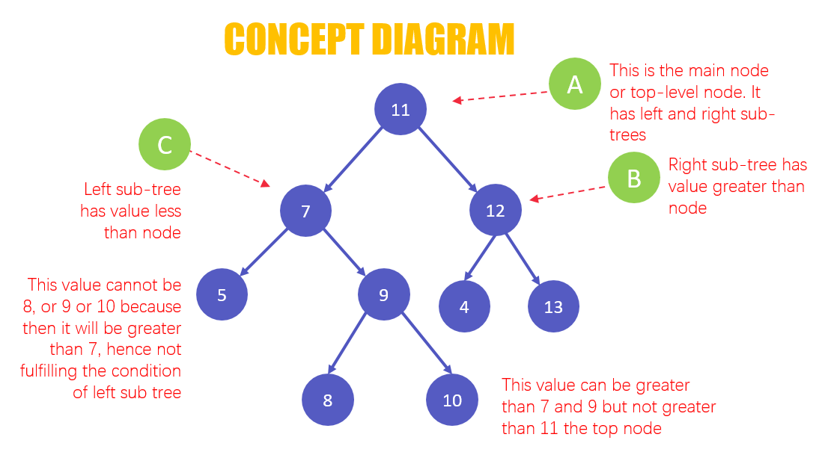
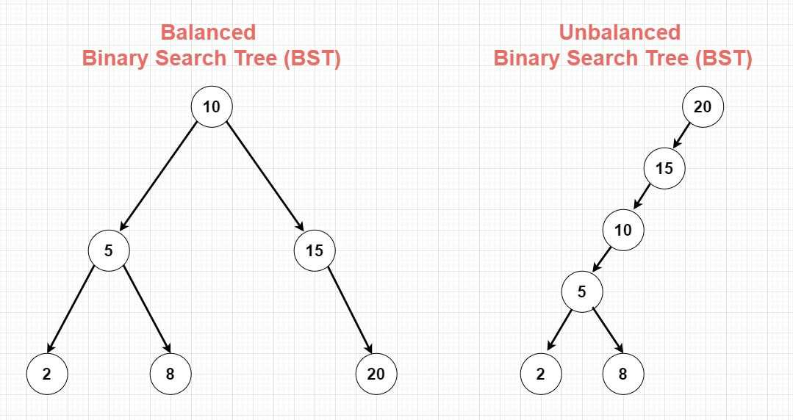

# Binary Search Tree
Binary search trees are a type of binary tree data structure in which the value of a new node will determine it's placing in the array. It's called binary due to the fact that there are only two options with placing each new Node. As a reminder, a Node is a location that store data that can be split into multiple values. Most of the time, these data structure's Nodes additional values will be addresses that link the data in a certain order. This structure will start with a single Node and use that as a starting comparison for every new Node. If greater, than the Node will be placed to the right/above the head Node. If less, than it'll be placed to the left/below the head.



After we add each new Node, we'll do that same orginal comparison with the additional ones. If a new node was great than the head we'd assign it to the right, but if there is another Node there we will do that same comparison. If it's smaller than the second than it would be right of the head than left of the Node. As you can see, Binary search trees do not have the most complex rules. Now if we split an arrays total and find the medium it works great. The issue is most arrays don't work that way. This means when our arrays are inputed our binary tree branches may be uneven. Fixing this by moving the Nodes in the tree is fairly complex so we won't cover that option. The other option would require us choosing certin items in the array to add before others to prevent this.



## Big O Notation
The Big O Notation for binary search tree is O(log n). This means that the time complexity of searching, inserting and deleting stay relatively the same unlike linked lists. O(log n) essentially means that our time complexity will increase consistently as we increase our inputs. Where most linear or polynomial time complexities will increase in growing amounts, a logarithmic time complexity will increase by the same amount for every additional input. This means that a large array will not majorly increase the length of time. This mean binary search trees will handle large amounts of data very well.

## Set Up
The set up of a Binary Search Tree isn't much more complex than what  we have seen before with the Linked Lists. We will be using Nodes again and linking the addresses of other Nodes. We'll have a left and right Node both for greater and than less than.

```csharp
// Setting up the tree structure
public class BinarySearchTree
{
    private Node? _root;

    public BinarySearchTree()
    {
        _root = null;
    }
}

// Setting up the Node structure
public class Node 
{
    public int Data { get; set; }
    public Node? Right { get; private set; }
    public Node? Left { get; private set; }

    public Node(int data)
    {
        this.Data = data;
    }
}
```


## Basic Operations
We'll have to create basic operations like Insert, Display, and contains. All of these should have defaults in case of an empty tree.

```csharp
// Function for inserting new values as Nodes into a binary tree
public void Insert(int value)
{
    if (value == Data)
    {

    }
    else if (value < Data)
    {
        // Insert to the left
        if (Left is null)
            Left = new Node(value);
        else
            Left.Insert(value);
    }
    else
    {
        // Insert to the right
        if (Right is null)
            Right = new Node(value);
        else
            Right.Insert(value);
    }
}

// Checks if a value is found within a binary tree
public bool Contains(int value)
{
    node = new Node(value);
    if (node is not null)
    {
        if (node.Data == value)
        {
            return true;
        }
        else
        {
            if (Contains(node.Left, value))
            {
                return true;
            }

            if (Contains(node.Right, value))
            {
                return true;
            }
        }
    }

// Display all values found within a binary tree
public void Display()
{
    if (Left != null)
    {
        Left.Display();
    }
    Console.Write(Value + " ");
    if (Right != null)
    {
        Right.Display();
    }
}
}
```

## Problem
For this coding exercise, we're going to try to create two different operations. Nothing is more annoying than being forced to repeat the same repetitive step over and over again. To prevent us from having to deal with this annoyance, we'll create an operation to serialize the tree and another to deserialize. This will require us to have to go through the list and add the values in the nodes into a new string. One of the best ways to do this is to use a queue. Here's some basic operations that you can use with a queue.

```csharp
Queue<int> queue = new Queue<int>();

queue.Enqueue(1);
queue.Enqueue(2);
queue.Enqueue(3);
queue.Enqueue(4);

int value = queue.Dequeue();
// Removes the first value in the queue and store it as value

int count = queue.Count
// Counts the amount of items in the queue and stores it as count
```

## Solution

Here is the solution [code](Solution/Program.cs).

### Example
Here is the sample [code](Example/Program.cs).

### Problem
Here is the template [code](Problem/Program.cs).

### Solution
Here is the sample [code](Solution/Program.cs).

