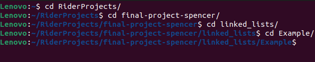
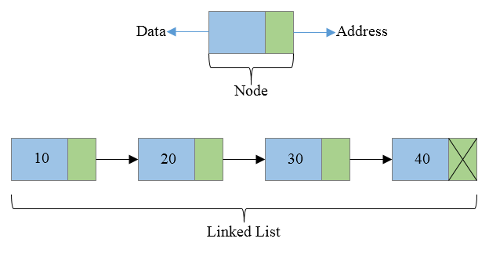

# Linked Lists
Linked lists are a very handy kind of test.  They're 
like arrays, but instead of having one value for each 
value, you remember the data after as well. The best 
example of this is file management on computers. We love 
organization which is exactly why we use linked lists. 
It makes tasks much easier when we can recall values 
this way. In terminal based systems we use the change 
directory command "cd" to switch the directories we're 
in. Directories can also be viewed as a folder. It's 
where we choose to store certain items. The way this 
relates to a linked list is that when you view a folder 
it will recall what's in it and where it is. 
Specifically the path to get there.



This is the most common example of linked lists in 
modern society. To access files, we need to recall which 
areas are coming along next. That is the exact purpose 
and function of linked lists. How would one carry this 
method out? Well we first would need to introduce Nodes. 
Imagine a christmas advent calendar. Each box has the 
day and item inside connected to its value. A Node in 
this situation would be each individual box. Each one is 
the location where we keep all the information we need 
for that specific Node in that data structure. In a 
linked list the Node will include a piece of data and 
the address of the following data.



## Big O Notation
Linked lists vary on complexity per operation. The majority of the time  they perform at O(n). This means they're repeating, but not with loops within loops. Anytime our operation has to sort through the linked list it is looping. The times it doesn't follow this pattern are when we add or remove from the beginning. Since it's in a set place we just go to the first Node and complete the operation. When we are trying to find another value we have to follow the addresses in each Node by looping. Even if it's the last Node we still have to cycle through all the earlier Nodes.

A stack would be able to get the last value, but wouldn't keep track of any of the other values. Even with the stack being able to get the last value quickly we can see the opposite problem with finding the first value. This is why it's important to use different data structures for different situations. Using the normal list for every situation causes so much inefficiency. The main way to check how well one could work in a situation is based off the Big O. Sometimes depending on the experience of the user it can change too. Linked lists requires more of a foundation of code for this data structure.

## Set Up

Setting up stacks in C# is fairly easy, but linked list in comparison is much more complex. We have to write the majority of it's operations and have to define the Node to hold the data type we're storing.

```csharp
// Creating a new stack in C#
Stack<String> newString = new Stack<string>();

// Creating a new Node
public Node
{
public int Data;
public Node Next;

public Node(int data)
{
    Data = data;
    Next = null;
}
}

//Starting the Linked List
public LinkedList
{
private Node head;
}
public LinkedList()
{
    head = null;
}

// An operation that adds a new piece of data
public void Add(int data)
{
    Node newNode = new Node(data);
    if (head == null)
    {
        head = newNode;
        return;
    }

    Node lastNode = head;
    while (lastNode.Next != null)
    {
        lastNode = lastNode.Next;
    }

    lastNode.Next = newNode;
}
```

## Basic Operations
These can include addFirst, addLast, add, removeFirst, removeLast, or remove. Adding and removing from a predetermined point os much easier than choosing random addresses to alter.
```csharp
// Add to beginning of linked list
public void AddFirst(int value) {
    ListNode newNode = new ListNode(value);
    newNode.next = head;
    head = newNode;
}

// Remove from beginning of the linked list
public int RemoveFirst() {
    if (head == null) {
        throw new InvalidOperationException("Cannot remove from an empty list");
    }

    int removedValue = head.val;
    head = head.next;
    return removedValue;
}
```
## Problem
The problem we'll try to resolve with a linked list is removing duplicates in a sorted array. We'll add values to a linked list and have an operation that will sort through the Nodes to discover any common values. There will be a few different ways to accomplish this. Hashsets are a great place to start for coding this solution. Below are the code samples for all three aspects.

### Example
Here is the sample [code](Example/Program.cs).

### Problem
Here is the sample [code](Problem/Program.cs).

### Solution
Here is the sample [code](Solution/Program.cs).

