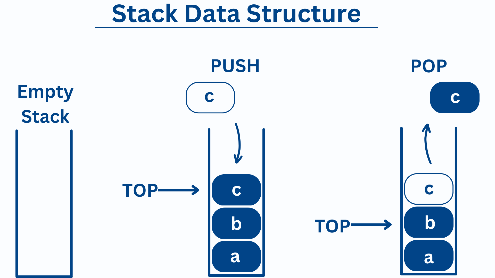

# Stacks

Most beginning programmers know how to use basic lists well when coding projects. However, 
sometimes there's a better alternative to hold the data in the program. One of these different
options is called stacks. A stack is a type of list that adds the most recent addition to the top
of the list and removes items from the same place. It's similar to when we stack boxes when moving. If you accidentally pack something you need at the bottom then you have to take everything else off the top first. This differs from lists because it does not use indexes and from queues because it removes from the top instead of the bottom.

Stacks can be used for multiple different types of situations. Some of the most common can include memory management, algorithm backtracking, and any undo operations. All of these can work better by applying the Last-In-First-Out method(LIFO). Queues use the opposite method of First-In-First-Out method(FIFO).It can save time and help us lower the amount of tracking a lists items. This data structure is fairly simple with built in operations. It does not require Nodes which we will learn about in linked lists, but can be inputed with values. 



## Big O Notation

The simplicity of stacks results in a simple Big O Notation as it only has two main operations: push and pop. This notation in O(1) which means it does not loop through. There is one exception which is where we are searching for a item in the stack. When we search in a stack we have to loop through the stack comparing it to its items. When pushing, O(1) means that we'll push the item into the stack and then be done. The same happens when we pop items except that they are removed. This is similar to how git works. It will take your most recent save and remove it to be added to a hub.


## Set Up & Basic Operations
To set up a stack C# only requires one line. Its basic operations are built in and include the following: push, pop, contains, and count.

```csharp
Stack<String> stack = new Stack<string>();

stack.push(1); // Add item to the top of the stack
stack.push(2);

stack.Count();   // Get number of items in the stack

stack.Contains();// Check if an item exists in the stack

stack.pop( );    // Remove and return the item from the top of the stack
```

## Problem

Now that we've covered what a stack is, let's find a problem we can solve with them. We're going to attempt to mimic the functions of a basic computer's keyboard. A keyboard will input a single character at a time into the computer dependent on what keys are pressed. What happens when a individual makes a mistake? We backspace to remove or undo the mistake. We'll attempt to write a program that mimics this in C#.


### Example
Here is the sample [code](Example/Program.cs).

### Problem
Here is the template [code](Problem/Program.cs).

### Solution
Here is the sample [code](Solution/Program.cs).
